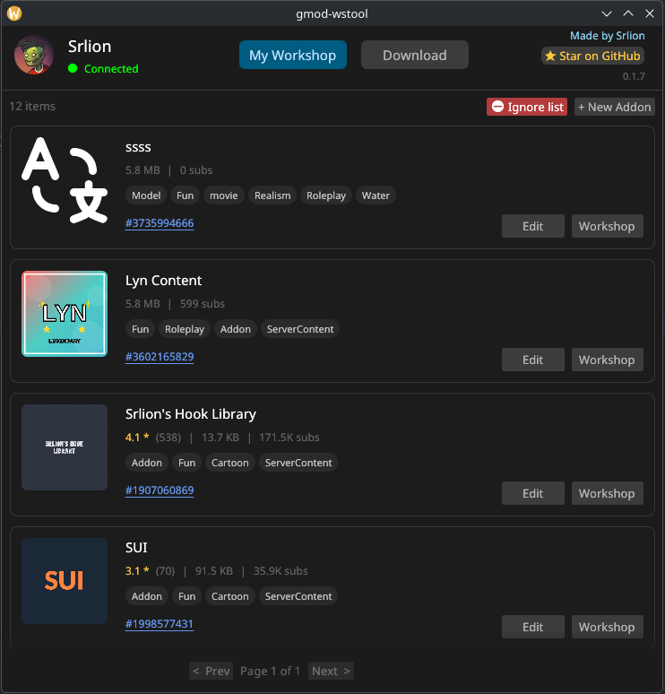
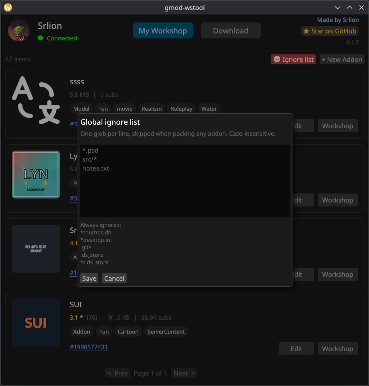
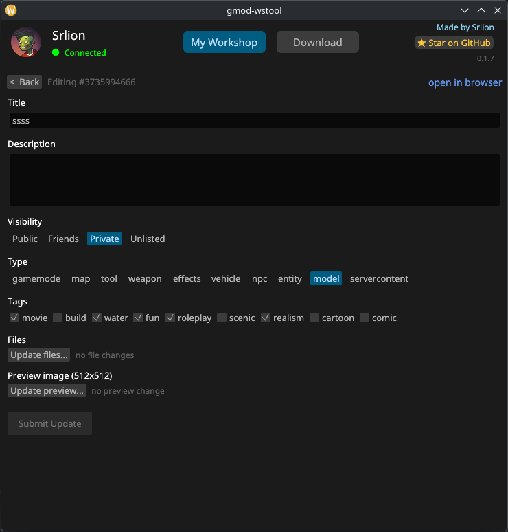
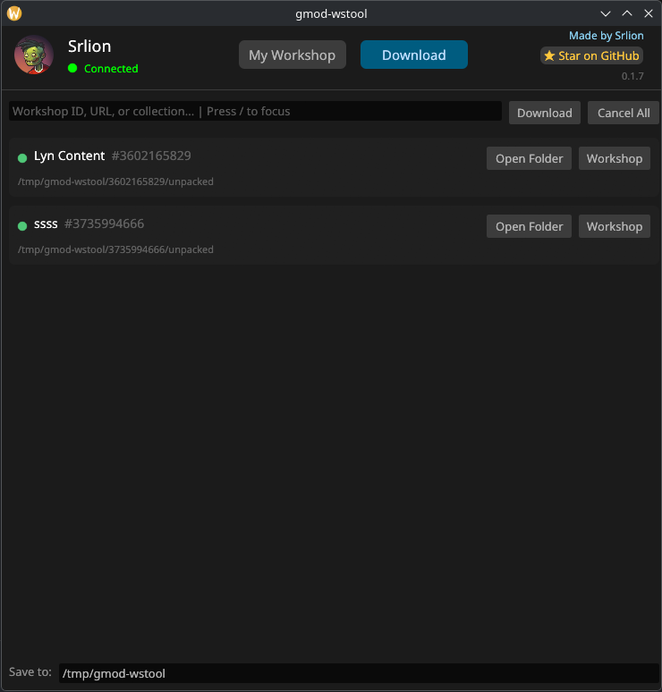

# gmod-wstool

Manage, download, and publish your Gmod workshop addons with ease.


## Installation

### Linux

Supports **Debian/Ubuntu**, **Red Hat/Fedora**, and **Arch Linux**.

```sh
curl -fsSL https://raw.githubusercontent.com/Srlion/gmod-wstool/master/install.sh | bash
```

### Windows

Download the latest `.msi` from the [releases page](https://github.com/Srlion/gmod-wstool/releases/latest) and run it.

**Note**: Smart App Control might block the installer, this is because the installer is not signed. This should be fixed in the future when I understand how to sign installers.

## Features

- Very lightweight, fast and responsive. (No webview or electron)
- View, edit and update your Gmod Workshop addons.
- Download addons from the Workshop and edit them locally. (Unpacks the gma file automatically)

## Preview





